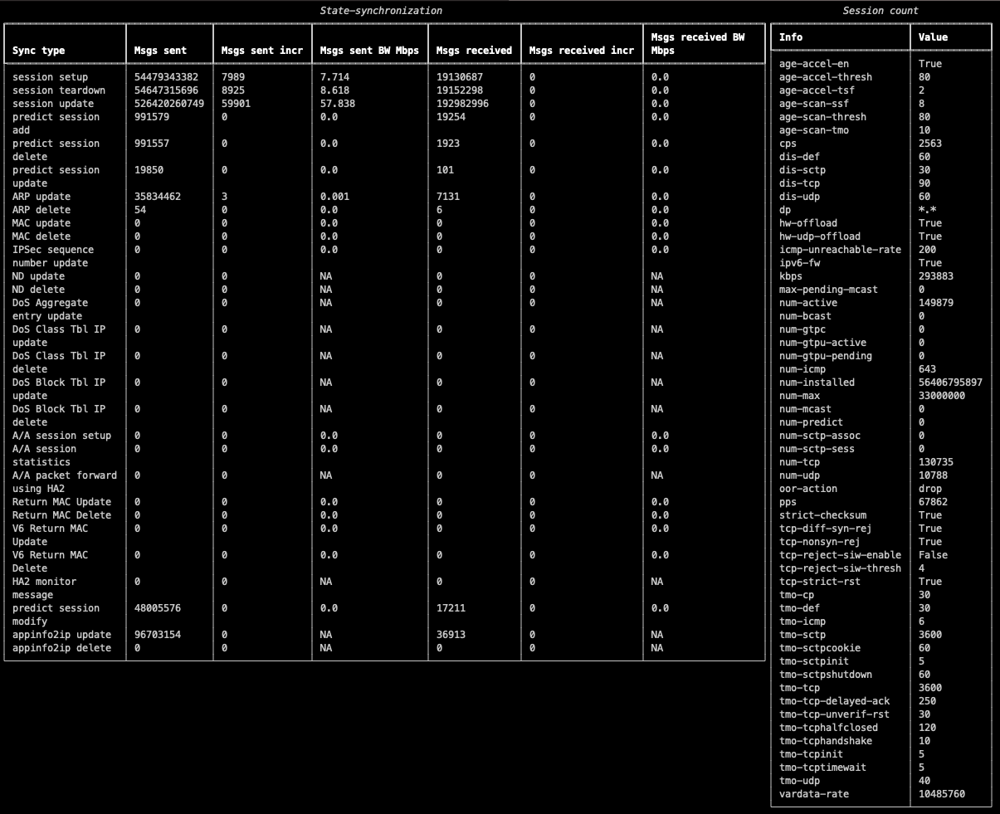

# Palo Alto HA sync link analyzer

Displays real-time statistics / average BW calculation for the HA synchronization link of Palo Alto firewalls. 
Uses "show high-availability state-synchronization" and "show session info" commands outputs (through API calls) at regular intervals and computes the increases to calculate BW / increase of the different synchronization messages types. 

## Installation

#### 1. Clone the repo to your working directory
```
$ git clone https://github.com/AnthoBalitrand/palo-ha-link-analyzer
```

#### 2. Create a virtual environment (optional) and activate it
```
$ python3 -m venv ./venv
$ source venv/bin/activate
```

#### 3. Install the requirements
```
$ pip3 install --trusted-host pypi.org --trusted-host files.pythonhosted.org -r requirements.txt
```

## Usage

Just start the script, you'll be prompted for API connection information and refresh interval

```
$ python3 src/palo_ha_link_analyzer.py

Palo Alto appliance IP ? : 192.168.1.100
Username for API connection ?: admin
Password for API connection ?:
Values update interval ?: 3

```


